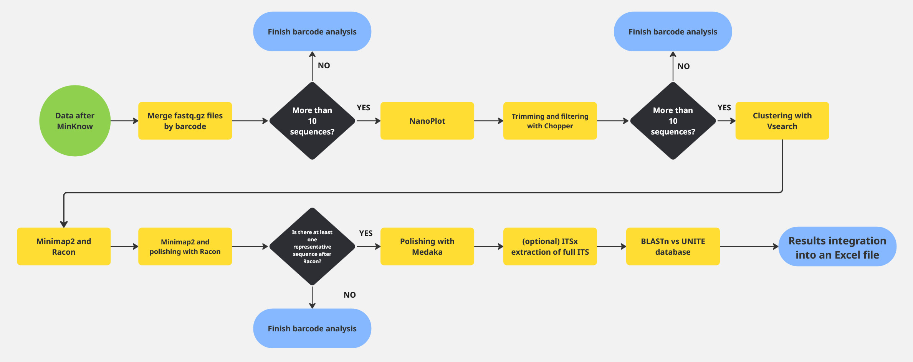

# Nanopore Fungal Barcodes Pipeline

A bioinformatics pipeline for processing Nanopore barcoding data of fungi using the Nextflow workflow system.

This pipeline streamlines the conversion of Oxford Nanopore Technologies (ONT) basecaller output into high-quality Internal Transcribed Spacer (ITS) sequences. It is designed to work with demultiplexed basecalling results generated by MinKNOW or Dorado—the latter being the current default basecaller integrated into MinKNOW.




The workflow includes several key steps:
- **Clustering** of similar reads
- **Polishing** to improve read accuracy
- **ITS extraction** (optional)
- **Taxonomy assignment**

This modular structure enables researchers to efficiently generate and analyze ITS sequences from ONT data with minimal manual intervention.

## Data Prerequisites

- Each barcode should contain one fungal sample. The pipeline includes logic to account for potential contamination.

## Input Data

- The pipeline automatically discovers and processes all barcode folders located in the `pass` directory of the provided folder structure.

## Usage

```
FUNGAL BARCODING WITH ONT: This pipeline streamlines the conversion of Oxford Nanopore Technologies (ONT) basecaller output into high-quality Internal Transcribed Spacer (ITS) sequences.

Required arguments:

  --ONT_DIRECTORY  Location of the input file file.

  --BLASTDB_PATH  Location of the input file file.

  --RUN_ID  Location of the input file file.

Optional arguments:

  --MEDAKA_MODEL  Medaka inference model. [default: r1041_e82_400bps_hac_variant_v4.3.0]

  --USE_ITSX  Set to 0 if you want to ommit extraction of full ITS region using ITSx. [default: 1]

  --CHOPPER_MIN_READ_LENGTH Reads shorter than this value wont be used for clusters generation. [default: 150]

  --CHOPPER_MAX_READ_LENGTH  Reads longer than this value wont be used for clusters generation. [default: 1000]

  --REL_ABU_THRESHOLD  Output only clusters with barcode-wise relative abundance above this value. [default: 10]

```

## Installation

- The pipeline is designed to be run using [NextFlow](https://www.nextflow.io/) - a scientific workflow system for bioinformatic data analysis. Thank to that it allows for scalable and paraller running of different steps on multiple barcodes at once.


### 1. Install Nextflow via Conda
```bash
conda create -n nf-env -c bioconda -c conda-forge nextflow
```

### 2. Clone the Repository
```bash
git clone git@github.com:mdziurzynski/ont_fungal_barcoding_pipeline.git
cd ont_fungal_barcoding_pipeline
```

### 3. Prepare the BLAST Database (e.g., using UNITE)

- Download the FASTA release of the UNITE database.
- Unpack the archive and create a BLAST database:

```bash
makeblastdb -in <your_unite.fasta> -dbtype nucl -out <unite_blastdb>/db
```

## Running the Pipeline

> ⚠️ The first run may take longer due to Conda environment setup.

> ⚠️ ️All paths MUST be absolute!

```bash
conda activate nf-env
nextflow run main.nf \
    --ONT_DIRECTORY <FULL PATH to basecalled ONT data (must contain pass/ with barcode01-XX folders)> \
    --BLASTDB_PATH <FULL PATH to folder containing unite_blastdb> \
    --RUN_ID <your analysis ID>
```

---


## Results

- **NanoPlot report** for each barcode, allowing visual quality assessment of the reads.
- **Excel summary table** listing identified sequences for each barcode. Due to contamination or inherent variability in ONT data, more than one sequence may be identified per barcode.

## Output Files

- `"{barcode_name}_NanoPlot_results"` — Contains NanoPlot output including `NanoPlot-report.html`, which should be inspected for read count and overall quality. Verify that the majority of reads align with expected characteristics.
- `"{run_id}.results.xlsx"` — The primary result file containing detailed information about sequence clusters and taxonomic assignments.

This Excel file may contain multiple records per barcode, including entries with the same taxonomic assignment. To select the most representative sequence, consider both the cluster size and its relative abundance within the barcode dataset.

For downstream applications, it is recommended to further align these sequences against diverse reference databases or incorporate them into phylogenetic analyses to confirm and refine taxonomic placement.

### Columns in the Results Excel File
- _Barcode_
- _Number of clusters_ – Clusters in barcode data at 95% identity threshold
- _Total reads after filtering_
- _Cluster ID_ – Unique identifier for the cluster representative sequence
- _Cluster size_ – Number of sequences in the cluster
- _Cluster relative abundance_ –Proportion of sequences in the cluster relative to the barcode total
- _Cluster sequence_ – Extracted ITS sequence using ITSx
- _Cluster sequence untrimmed_ –Polished sequence prior to ITSx trimming
- _BLASTn taxonomy assignment_
- _BLASTn percent identity_
- _BLASTn query coverage_
- _BLASTn query length_
- _BLASTn subject length_
- _BLASTn e-value_
- _BLASTn subject SH_
- _BLASTn full taxonomy_
